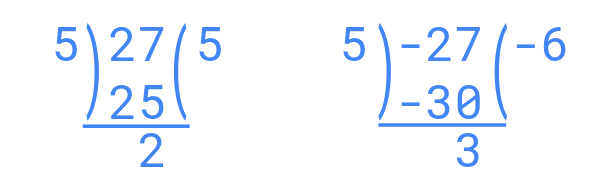
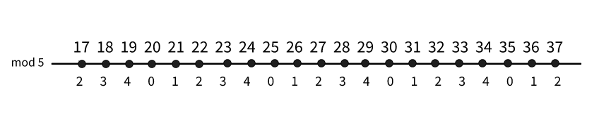

# মডুলার অ্যারিথমেটিক
**Modular Arithmatic** নাম্বার থিওরি জগতের অন্যতম গুরুত্বপূর্ণ একটি অধ্যায়। যেকোনো নরমাল রেঞ্জ এর নাম্বার যাদেরকে আমরা কোনো প্রোগ্রামিং ল্যাঙ্গুয়েজ এর বেসিক ডাটা টাইপ (যেমন `int`, `long`, `long long`) এ রেখে বেসিক এরিথমেটিক অপারেশন যেমন যোগ, বিয়োগ, গুন্, ভাগ (ভাগ নিয়ে  আপাতত আলোচনা করছি না) গুলো করতে পারি। কিন্তু এর চেয়ে বড় কোনো সংখ্যা যাদেরকে আমরা সম্পূর্ণরূপে কোনো ডাটা টাইপ এ রাখতে পারি না, তাদেরকে নিয়ে কিভাবে কাজ করা যায়? 

মনে করো তোমাকে খুব বড় দুটি সংখ্যা যেমন ২<sup>৯৯</sup> আর ২<sup>১০০</sup> যোগ করতে  দেয়া হয়েছে। তোমাকে সংখ্যাদুটোর যোগফল পূর্ণসংখ্যাটি দিতে হবে না, শুধুমাত্র শেষের ৬-৭ টি ডিজিট দিলেই চলবে। তাহলে এখন তুমি কিভাবে করবে? প্রশ্নটির উত্তর যদি তুমি এক ঝলকে চিন্তা ছাড়াই বলে ফেলতে না পারো, তাহলে এই লিখাটি তোমার জন্যই, স্বাগতম তোমাকে। আপাতত প্রশ্নটি মাথায় রেখে সামনে যাওয়া যাক।

# ভাগশেষ
কোনো সংখ্যা *N* কে ম্যাথমেটিক্যালি প্রকাশ করার একটা সুন্দর পদ্ধতি হলো- *N=D\*Q+r*, যেখানে *D* হচ্ছে ভাজক (Divisor), *Q* হচ্ছে  ভাগফল (Quotient), আর *r* হচ্ছে ভাগশেষ (reminder)। আচ্ছা, ২৭ কে ৫ দিয়ে ভাগ করলে ভাগশেষ কত? বিড়বিড় করে হয়তো হিসেবে করে ফেলেছো, উত্তর ২। এবার যদি বলি, -২৭ কে ৫ দিয়ে ভাগ করলে ভাগশেষ কত, তাহলে তোমার উত্তর কত? 

উত্তর এর আগে জানা দরকার আসলে ভাগশেষের কনসেপ্ট আমাদের কতটুকু সুস্পষ্ট।  ভাগশেষ হচ্ছে কোনো পূর্ণসংখ্যাকে অন্য পূর্ণসংখ্যা দিয়ে ভাগ করলে অবশিষ্ট অংশ। ২৭ কে যখন আমরা ৫ দিয়ে ভাগ করি, তখন আমরা মূলত ২৭ এর সমান/ছোট সবচেয়ে বড় ৫ এর গুণিতক খুঁজে বের করি (৫*৫=২৫)। তাহলে ভাগশেষ হবে ২৭-২৫=২। তাহলে যখন আমরা -২৭ কে ৫ দিয়ে ভাগ করবো, তখন তার সমান/ছোট সবচেয়ে বড় ৫ এর গুণিতক কত? -৩০ নাকি -২৫? লজিক্যালি কখনোই -২৫ হবে না, কারণ -২৫ অবশ্যই -২৭ অপেক্ষা বড় । তাহলে ভাগশেষ হবে -২৭-(-৩০) = -২৭+৩০ = ৩। আরেকটা বিষয় হচ্ছে, যদি আমরা -২৫ কে ভুলক্রমে নিয়েও  ফেলি,তাহলে ভাগশেষ হবে -২৭-(-২৫) = -২৭+২৫ = -২। জ্ঞাতার্থে জানিয়ে রাখি, ভাগশেষ, তথা "অবশিষ্ট" কখনোই ঋণাত্মক হতে পারে না।

<div align="center">
    
</div>
<br>

এইবার তুমি একটা ঝটফট কোড লিখে ফেলতে পারো ভাগশেষ নির্ণয় করার। C/C++ এ যদি লিখার চেষ্টা করো, তাহলে কোড টি হবে নিম্নরূপ:

```cpp
int getReminder(int n, int m) {
    int rem = n % m;
    return rem;
}
```

কিন্তু দুঃখের বিষয় হলো, কোডটি তোমায় চরম হতাশ করে ফেলবে, আমার এতো জ্ঞানগর্ভ আলোচনা বৃথা মনে হবে। কেননা C/C++ বিল্ট-ইন মডুলো অপারেটর তোমাকে রিটার্ন করবে -২৭ mod ৫ = -২। কিন্তু বাস্তবতা হলো, কম্পাইলার এখানে -২৭ এর জন্য ৫ এর গুণিতক নিয়েছে -২৫, যা আমরা ইতোপূর্বে প্রমান করেছি যে এটি ভুল সিদ্ধান্ত (আসলে কম্পাইলার জেনেশুনেই এই ভুলটি করে, কেন করে সেটা নিয়ে অন্য কোনদিন আলোচনা করা যেতে পারে)। তাহলে আমরা এখন কিভাবে আমাদের প্রয়োজনীয় আউটপুট পেতে পারি?

কোনো সংখ্যা *N* কে যদি *M* দ্বারা ভাগ করে ভাগশেষ *r* পাওয়া যায়, তাহলে *N+M, N+2M, N+3M, ...* সবার জন্যই ভাগশেষ হবে *r* । উদাহরণস্বরূপ, ২৭ mod ৫ = ২, তাহলে ২৭, ৩২, ৩৭, ৪২, .... সবার জন্যই ভাগশেষ ২। কেননা ৫ ভাজকের জন্য ভাগশেষ প্রতি ৫ সংখ্যা পর পর রিপিট করবে (০, ১, ২, ৩, ৪, ০, ১, ...)।  অনুরূপ ঘটনা ঋণাত্মক দিকেও প্রযোজ্য, (..., ১২, ১৭, ২২, ২৭) এর জন্যও  ভাগশেষ হবে ২।

<div align="center">
    
</div>
<br>


তাহলে আমরা ঋণাত্মক সংখ্যার ভাগশেষ কিভাবে নির্ণয় করতে পারি? একটা পদ্ধতি হতে পারে যে, ঋণাত্মক সংখ্যাটির সাথে এমন একটা ভাজক ৫ এর ধনাত্মক গুণিতক যোগ করবো, যেন তাদের যোগফল ধনাত্মক হয়, তাহলে ওই নম্বর এর ভাগশেষ হবে প্রদত্ত ঋণাত্মক সংখ্যাটির ভাগশেষ। অর্থাৎ, 

$$ -27 \mod 5 = (-27 + 5*10) \mod 5 = 23 \mod 5 = 3 $$

দ্বিতীয় পদ্ধতি টি অনেক সিম্পল, সহজ এবং বোধগম্য। ভাগশেষের সাথে ৫ এর যেকোনো গুণিতক যোগ করে যদি আবার ভাগশেষ বের করি, তাহলে কি আমরা নতুন কোনো ভাগশেষ পাবো? কখনোই সম্ভব না, কারণ সবসময় গুণিতক পরিমান বাড়ছে, আবার ভাগ হয়ে ভাগশেষের সমান হয়ে যাচ্ছে। এই প্রেক্ষিতে বলতে পারি,

$$ (N \mod M) = ((N \mod M) + M) \mod M $$

এই ছোট্ট লজিক টা যদি আমরা কনসিডার করি, তাহলে ঋণাত্মক সংহার জন্য  কম্পাইলার এর করা ভুল এড়িয়ে আমরা আমাদের কাঙ্খিত রেজাল্ট পেতে পারবো। অর্থাৎ,

$$ 27 \mod 5 = ((27 \mod 5) + 5) \mod 5 = (2 + 5) \mod 5 = 7 \mod 5 = 2 $$

$$ -27 \mod 5 = ((-27 \mod 5) + 5) \mod 5 = (-2 + 5) \mod 5 = 3 \mod 5 = 3 $$

তাহলে এখন কোড টি হবে নিম্নরূপ, যা সকল সংখ্যার জন্য কার্যকর:

```cpp
int getReminder(int n, int m) {
    int rem = ((n % m) + m) % m;
    return rem;
}
```


## মডুলো যোগ, বিয়োগ, ও গুণ 
এইবার মডুলার এরিথমেটিক অপারেশন নিয়ে কথা বলা যাক। ধরো, তোমার কাছে দুটি সংখ্যা আছে। এইবার তোমাকে বলা হলো, মূল সংখ্যা দুইটি কে যদি যোগ করা হতো, এবং অন্য একটি সংখ্যা দিয়ে ভাগ করা হতো, তাহলে ভাগশেষ কত হতো? কিছুক্ষন ভেবে নিতে পারো। যদি ভেবে কোনো সল্যুশন এর সন্ধান না পাও, তাহলে হতাশ না হয়ে নিচের অংশটুকু পড়ে ফেলো। 

মনে করো, সংখ্যা দুটি ছিল যথাক্রমে *A* ও *B*, এবং যেই সংখ্যা দিয়ে ভাগ করতে বলা হয়েছে, তা হলো *m*। ম্যাথমেটিক্যালি বললে, আর তোমার কাছে জানতে চাওয়া হয়েছে * (A+B) \mod m * । যেহেতু আমাদের উত্তর দিতে হবে একটা ভাগশেষ, তাই শুরু থেকেই ভাগশেষ নিয়ে চিন্তা করা যাক। A ও B কে আমরা একটু ভেঙে লিখলে দাঁড়ায়,

$$ A = m * Da + ra $$

$$ B = m * Db + rb $$

তাহলে চলো একটা অঙ্ক করে ফেলা যাক, 

$$ (A+B) \mod m $$

$$ = (m * Da + ra + m * Db + rb) \mod m $$

$$ = (m * (Da + Db) + (ra + rb)) \mod m $$

$$ = (m * (Da + Db)) \mod m + (ra + rb) \mod m $$


*m * (Da + Db)* যেহেতু *m* এর গুণিতক, তাই এই অংশের ভাগশেষ শুন্য। 

$$ = 0 + (ra + rb) \mod m $$

$$ = (ra + rb) \mod m $$ 

উপরোক্ত সমীকরণের আলোকে দেখা গেলো, আলটিমেট ইমপ্যাক্ট রাখছে জাস্ট দুটো সংখ্যা ra ও rb, যাদের একটা বড় পরিচয় আছে। তারা হচ্ছে যথাক্রমে A ও B এর ভাগশেষ। তাহলে আমরা আমাদের ফাইনাল গোলে এভাবে পৌঁছাতে পারি যে, 

$$ (A+B) \mod m = ((A \mod m) + (B \mod m)) \mod m $$


মডুলো যোগ এর মতো করে অনুরূপভাবে আমরা বিয়োগ ও গুণের জন্যেও সমীকরণ প্রমান করতে পারি। তাহলে আমরা তিনটি ফর্মুলা নিচের মতো করে লিখে নিতে পারি:

$$ (A+B) \mod m = ((A \mod m) + (B \mod m)) \mod m $$

$$ (A-B) \mod m = ((A \mod m) - (B \mod m)) \mod m $$

$$ (A*B) \mod m = ((A \mod m) * (B \mod m)) \mod m $$


বিয়োগ করার সময় জাস্ট সময়  মনে রাখা দরকার যে, এখানে কখনো নেগেটিভ মান চলে আসতে পারে। তাই  নেগেটিভ মডুলো এর বিষয়টা মাথায় রেখে কাজ করা দরকার। 

এতক্ষন ধরে এই বোরিং আলোচনা (আসলেই কি বোরিং?!) তে যদি তুমি বিরক্ত হয়ে থাকো, তাহলে এতক্ষনে হয়তো তোমার মাথায় একটা কোথায় ঘুরপাক খাচ্ছে, "এই জিনিস শিখে আমার লাভ টা কী?"। এ প্রশ্ন মাথায় আসাও স্বাভাবিক। প্রায়োগিক দিক জেনে শেখার আনন্দটা অনেক বেশি। এবার চলো একটা সমস্যা নিয়ে আলোচনা করা যাক।

কম্পিটিটিভ প্রোগ্রামিং এ অত্যন্ত গুরুত্বপূর্ণ একটি টপিক হচ্ছে ফ্যাক্টোরিয়াল নির্ণয় করা। এতদিন পর্যন্ত হয়তো আমরা জেনে গেছি কিভাবে ফ্যাক্টোরিয়াল বের করতে হয়। কিন্তু যদি তোমাকে আগের মতোই বলা হয়, যে ১০০! কে ১০০৭ দ্বারা ভাগ করলে ভাগশেষ কত হবে? হয়তো বুঝেই গেছো যে, ১০০! এর মান কখনোই কোনো ভ্যারিয়েবল এ রাখা সম্ভব না। তাহলে আমরা কিভাবে সল্ভ করতে পারি?

এতক্ষনে যেহেতু আমরা মডুলার এরিথমেটিক নিয়ে পড়াশোনা করে অনেক কিছু জেনে গেছি, তাই আমাদের পক্ষে এখন চিন্তা করাও সহজ। একটু ভেবে নাও, যদি না কোনো সল্যুশন পাও, তাহলে আবার চিন্তা করে দেখো। 
 

```cpp
int big_fact(int n, int m) {
    int res = 1;
    for(int i=1; i<=n; i++) {
        res = ((res%m) * (i%m)) % m;
    }
    return res;
}
```

মডুলো ভাগ অন্যগুলোর চেয়ে পুরোপুরি আলাদা, কেন আলাদা সেটা নিয়ে তুমি নিজে ঘাটাঘাটি করে দেখতে পারো। অন্য কোনো দিন এব্যাপারে আলোচনা করবো। 
